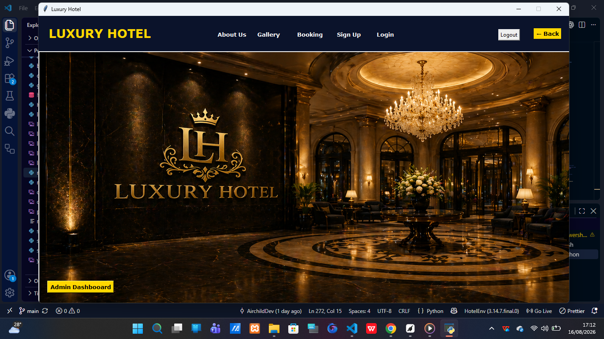
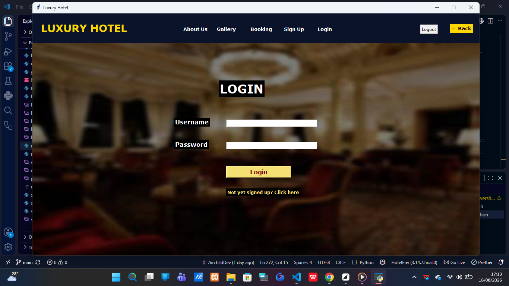
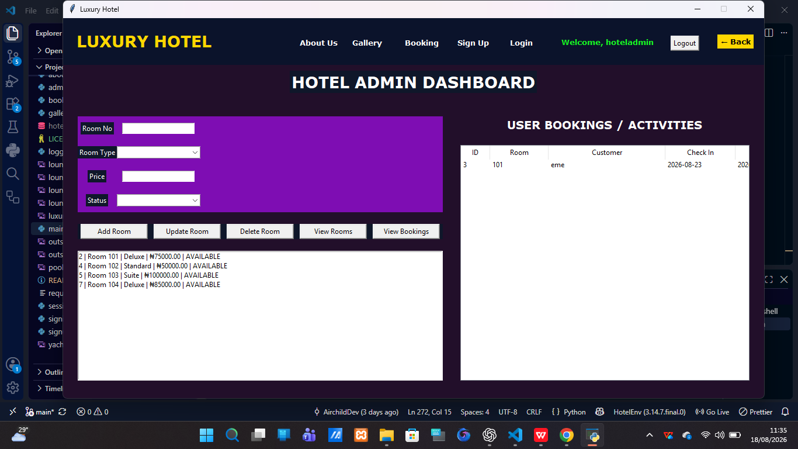
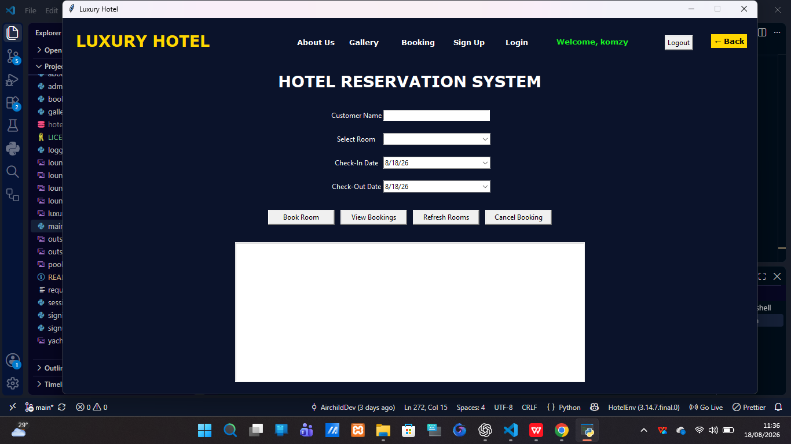
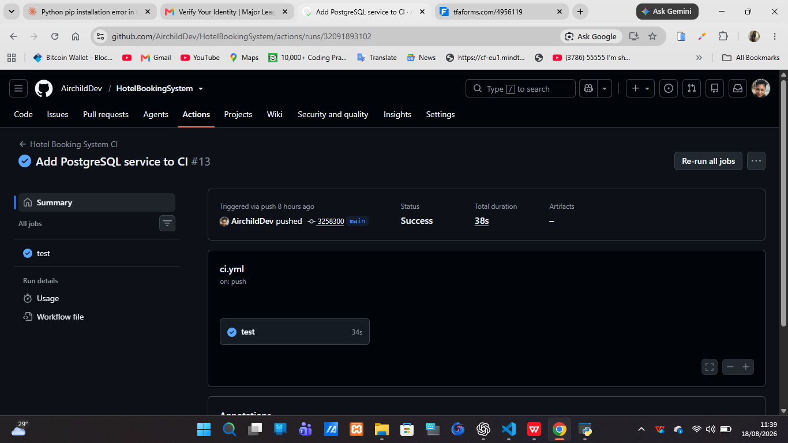

# Hotel Booking System

## Overview

Hotel Booking System is a Python desktop application for managing users, rooms, reservations, cancellations, and hotel operations. It uses Tkinter for the graphical interface and PostgreSQL for the active database.

The application was migrated from SQLite to PostgreSQL. The migration introduced centralized database connections, environment-based configuration, PostgreSQL-compatible queries, automated tests, and GitHub Actions continuous integration.

## Features

| Feature | Description |
|---|---|
| Registration and login | Creates and authenticates hotel-system users. |
| Administrator access | Supports hotel administration workflows. |
| Room management | Adds, views, updates, and deletes rooms. |
| Booking management | Lets authenticated users create and view reservations. |
| Booking cancellation | Lets users cancel their own bookings. |
| Availability validation | Prevents conflicting bookings for the same room and dates. |
| PostgreSQL database | Stores users, rooms, and bookings in a relational database. |
| Monitoring and recovery | Includes services that check database and application health. |
| Automated testing | Uses Python unittest tests. |
| Continuous integration | GitHub Actions runs tests against a temporary PostgreSQL database. |

## Screenshots

| UI screen | Signup screen | Login screen |
|---|---|---|
|  |  |  |

| Administrator | My bookings | GitHub Actions CI | 
|---|---|---|
|  |  |  | 

## Technology Stack

| Technology | Purpose |
|---|---|
| Python | Core application language. |
| Tkinter | Desktop graphical user interface. |
| PostgreSQL | Relational database for users, rooms, and bookings. |
| psycopg2-binary | Python PostgreSQL driver. |
| python-dotenv | Loads local environment variables from the .env file. |
| unittest | Automated test framework. |
| Git and GitHub | Version control and repository hosting. |
| GitHub Actions | Continuous integration. |

## Project Structure

    HotelBookingSystem/
      .github/
        workflows/
          ci.yml
      assets/
      database/
        connection.py
        postgres_connection.py
        postgres_schema.py
        schema.py
      services/
        booking_service.py
        monitor_service.py
        recovery_service.py
        room_service.py
      tests/
        test_hotel_system.py
        test_recovery.py
      bookingapp.py
      main_hotelapp.py
      signin.py
      signup.py
      requirements.txt
      .env.example
      .gitignore
      README.md

Local-only items such as .env, HotelEnv, logs, and backup should not be committed to GitHub.

## Prerequisites

| Requirement | Recommendation |
|---|---|
| Python | Python 3.12 or a compatible Python 3 version. |
| PostgreSQL | PostgreSQL 16 or later is recommended. |
| Git | Required to clone, commit, and push the repository. |
| Code editor | VS Code or another editor is recommended. |

## Installation

### Clone the repository

    git clone https://github.com/AirchildDev/HotelBookingSystem
    cd HotelBookingSystem

### Create and activate a virtual environment

    python -m venv HotelEnv
    HotelEnv\Scripts\Activate.ps1

When activation succeeds, the PowerShell prompt begins with (HotelEnv).

### Install dependencies

    python -m pip install --upgrade pip
    pip install -r requirements.txt

The requirements file must include at least:

    psycopg2-binary
    python-dotenv

Add other packages used by the Tkinter interface, such as a date widget package, when applicable.

## PostgreSQL Setup

### Create the database

Open PostgreSQL using an authorized administrator account and run:

    CREATE DATABASE hotel_booking;

### Configure the local environment file

Create a file named .env in the project root. Do not put it inside HotelEnv.

    DB_HOST=localhost
    DB_PORT=5432
    DB_NAME=hotel_booking
    DB_USER=postgres
    DB_PASSWORD=your_postgresql_password

The .env file contains private credentials. Keep it local and never commit it.

Create a safe .env.example template for other developers:

    DB_HOST=localhost
    DB_PORT=5432
    DB_NAME=hotel_booking
    DB_USER=postgres
    DB_PASSWORD=your_database_password

### Create database tables

After configuring .env, run this from the project root:

    python -c "from database.schema import create_tables; create_tables(); print('Database tables created successfully')"

The application database contains entities for users, rooms, and bookings.

## Verify the Database Connection

Run:

    python -c "from database.connection import get_connection; con=get_connection(); print('PostgreSQL connection successful'); con.close()"

Expected output:

    PostgreSQL connection successful

Verify the room service:

    python -c "from services.room_service import get_rooms; print(get_rooms())"

## Run the Application

Start the desktop application:

    python main_hotelapp.py

Recommended manual validation:

| Step | Action | Expected result |
|---|---|---|
| 1 | Start the application. | The login screen opens. |
| 2 | Register a new user. | A user account is created. |
| 3 | Log in as the new user. | The booking interface opens. |
| 4 | Select a room and valid dates. | A booking is created when the room is available. |
| 5 | View bookings. | The user sees only their own reservations. |
| 6 | Cancel a booking. | The selected booking is removed. |
| 7 | Log in as an administrator. | The administration interface opens. |
| 8 | Add, edit, and delete rooms. | Changes are saved in PostgreSQL. |

## Testing

Run the full automated test suite:

    python -m unittest discover -s tests -p "test_*.py" -v

Check the booking interface for syntax errors:

    python -m py_compile bookingapp.py

Compile Python files while excluding the virtual environment:

    python -m compileall . -x "HotelEnv"

A successful unittest run ends with an OK result. If local tests cannot connect to PostgreSQL, confirm that PostgreSQL is running and that the .env values are correct.

## Continuous Integration

The GitHub Actions workflow is stored here:

    .github/workflows/ci.yml

The workflow runs when code is pushed to main and when a pull request targets main.

| CI stage | Purpose |
|---|---|
| Checkout | Downloads repository code into the runner. |
| Python setup | Uses Python 3.12. |
| PostgreSQL service | Starts a temporary database for tests. |
| Environment configuration | Provides safe CI database variables. |
| Dependency installation | Installs packages from requirements.txt. |
| Test execution | Runs the unittest test suite. |

The workflow needs a PostgreSQL service and CI-only values like these:

    services:
      postgres:
        image: postgres:16
        env:
          POSTGRES_DB: hotel_booking
          POSTGRES_USER: postgres
          POSTGRES_PASSWORD: postgres
        ports:
          - 5432:5432
        options: >-
          --health-cmd "pg_isready -U postgres -d hotel_booking"
          --health-interval 10s
          --health-timeout 5s
          --health-retries 5

    env:
      DB_HOST: 127.0.0.1
      DB_PORT: 5432
      DB_NAME: hotel_booking
      DB_USER: postgres
      DB_PASSWORD: postgres

These are temporary values used only in GitHub Actions. They are not production database credentials.

## Security and Configuration

The .gitignore file should include at least:

    HotelEnv/
    __pycache__/
    *.pyc
    hotel.db
    logs/
    .env
    backup/

Before committing, verify that .env is ignored:

    git check-ignore -v .env

Check whether .env was ever tracked:

    git ls-files .env

No output is the desired result.

## SQLite to PostgreSQL Migration

| Previous SQLite approach | Current PostgreSQL approach |
|---|---|
| sqlite3.connect("hotel.db") | Centralized connection through get_connection() |
| SQLite question-mark placeholders | psycopg2 percent-s placeholders |
| Local hotel.db file | PostgreSQL hotel_booking database |
| Credentials in code during early development | Credentials read from .env |

Legacy SQLite material can remain in the local backup folder. The backup folder is ignored so the GitHub repository focuses on the active PostgreSQL system.

## Git Workflow

Use this reviewed workflow when publishing a change:

    git status
    git diff
    git add -A
    git diff --cached --check
    git diff --cached -- database/postgres_connection.py
    git commit -m "Describe your change"
    git push origin main

Before committing, inspect the PostgreSQL connection code and confirm that it reads the database password from environment variables instead of containing a real password.

After pushing, open the GitHub Actions tab and confirm that the workflow succeeds.

## Troubleshooting

| Problem | Likely cause | Recommended action |
|---|---|---|
| ModuleNotFoundError for psycopg2 | PostgreSQL driver is missing. | Add psycopg2-binary to requirements.txt and reinstall dependencies. |
| No password supplied | DB_PASSWORD is missing or .env was not loaded. | Confirm .env values and ensure the connection module calls load_dotenv(). |
| Password authentication failed | The local .env password is incorrect. | Verify the password using PostgreSQL, then update .env. |
| GitHub Actions PostgreSQL socket error | CI has no database service or no DB variables. | Add the PostgreSQL service and CI environment settings to ci.yml. |
| SQL syntax error near a question mark | SQLite placeholders remain in a PostgreSQL query. | Replace question-mark placeholders with percent-s placeholders. |
| .env appears in Git status | Ignore rules are missing or malformed. | Run git check-ignore -v .env and correct .gitignore. |
| CI test step is skipped | A previous CI step failed or a trigger does not match. | Inspect the first failed step in the GitHub Actions log. |

## Software Engineering Practices Demonstrated

| Practice | Implementation |
|---|---|
| Modular design | Database access and application logic are separated into packages and service modules. |
| Configuration management | Database settings are separated from code through environment variables. |
| Secret handling | .env is ignored by Git and real credentials are not committed. |
| Automated testing | The repository includes unittest tests. |
| Continuous integration | GitHub Actions runs tests in a clean environment. |
| Database migration | The project was updated from SQLite to PostgreSQL. |
| Failure handling | Database operations use error handling, rollback logic, monitoring, and recovery services. |
| Version control | Git is used to review, stage, commit, and publish changes. |

## Future Improvements

| Improvement | Benefit |
|---|---|
| Add a deployed web API or dashboard | Makes the project easier to demonstrate online. |
| Add schema migration tooling | Makes database updates repeatable across environments. |
| Add integration tests for booking overlaps | Strengthens reservation correctness. |
| Add code coverage reporting | Shows how much behavior is tested. |
| Add dependency and security scanning | Improves CI security checks. |
| Add scheduled backups and restore tests | Strengthens recovery readiness. |
| Add administrator audit logs | Improves traceability of important changes. |
| Package the desktop application | Makes installation easier for end users. |

## Author

Ekeoma Onuoha
https://github.com/AirchildDev

## Project Purpose:
The Hotel Booking system is a practical hotel management application built with Python and Tkinter to automate room availability,reservations, cancellations, and customer booking records. It uses PostgreSQL for persistent database management and GitHub Actions CI/CD for automated code validation, making the project a practical demonstration of database integration, software developement and and DevOps practices.

## License

This project is licensed under the MIT License. See the [LICENSE](LICENSE) file for details.
